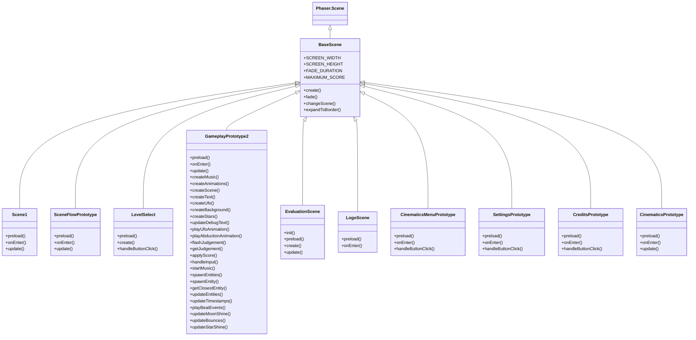

# Architecture

```mermaid
classDiagram

Phaser.Scene <|-- BaseScene

BaseScene <|-- Scene1
BaseScene <|-- SceneFlowPrototype
BaseScene <|-- LevelSelect
BaseScene <|-- GameplayPrototype2
BaseScene <|-- EvaluationScene

BaseScene <|-- LogoScene
BaseScene <|-- CinematicsMenuPrototype
BaseScene <|-- SettingsPrototype
BaseScene <|-- CreditsPrototype
BaseScene <|-- CinematicsPrototype

class BaseScene {
    +SCREEN_WIDTH
    +SCREEN_HEIGHT
    +FADE_DURATION
    +MAXIMUM_SCORE
    +create()
    +fade()
    +changeScene()
    +expandToBorder()
}

class Scene1 {
    +preload()
    +onEnter()
    +update()
}

class SceneFlowPrototype {
    +preload()
    +onEnter()
    +update()
}

class LogoScene {
    +preload()
    +onEnter()
}

class CinematicsMenuPrototype {
    +preload()
    +onEnter()
    +handleButtonClick()
}

class SettingsPrototype {
    +preload()
    +onEnter()
    +handleButtonClick()
}

class CreditsPrototype {
    +preload()
    +onEnter()
    +handleButtonClick()
}

class CinematicsPrototype {
    +preload()
    +onEnter()
    +update()
}

class LevelSelect {
    +preload()
    +create()
    +handleButtonClick()
}

class GameplayPrototype2 {
    +preload()
    +onEnter()
    +update()

    +createMusic()
    +createAnimations()
    +createScene()

    +createText()
    +createUfo()
    +createBackground()
    +createStars()

    +updateDebugText()

    +playUfoAnimation()
    +playAbductionAnimation()

    +flashJudgement()
    +getJudgement()
    +applyScore()

    +handleInput()
    +startMusic()

    +spawnEntities()
    +spawnEntity()
    +getClosestEntity()

    +updateEntities()
    +updateTimestamps()

    +playBeatEvents()
    +updateMoonShine()
    +updateBounces()
    +updateStarShine()
}

class EvaluationScene {
    +init()
    +preload()
    +create()
    +update()
}
```