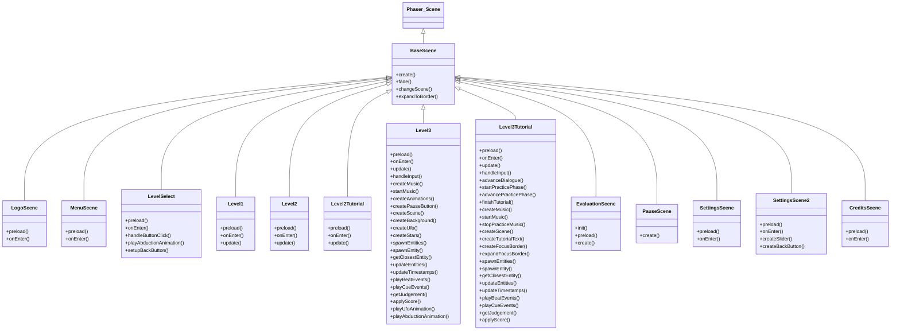

# Architecture

```mermaid
classDiagram

Phaser_Scene <|-- BaseScene

BaseScene <|-- LogoScene
BaseScene <|-- MenuScene
BaseScene <|-- LevelSelect

BaseScene <|-- Level1

BaseScene <|-- Level2
BaseScene <|-- Level2Tutorial

BaseScene <|-- Level3
BaseScene <|-- Level3Tutorial

BaseScene <|-- EvaluationScene

BaseScene <|-- PauseScene
BaseScene <|-- SettingsScene
BaseScene <|-- SettingsScene2
BaseScene <|-- CreditsScene

class BaseScene {
    +create()
    +fade()
    +changeScene()
    +expandToBorder()
}

class LogoScene {
    +preload()
    +onEnter()
}

class MenuScene {
    +preload()
    +onEnter()
}

class LevelSelect {
    +preload()
    +onEnter()
    +handleButtonClick()
    +playAbductionAnimation()
    +setupBackButton()
}

class Level1 {
    +preload()
    +onEnter()
    +update()
}

class Level2 {
    +preload()
    +onEnter()
    +update()
}

class Level2Tutorial {
    +preload()
    +onEnter()
    +update()
}

class Level3 {
    +preload()
    +onEnter()
    +update()
    +handleInput()
    +createMusic()
    +startMusic()
    +createAnimations()
    +createPauseButton()
    +createScene()
    +createBackground()
    +createUfo()
    +createStars()
    +spawnEntities()
    +spawnEntity()
    +getClosestEntity()
    +updateEntities()
    +updateTimestamps()
    +playBeatEvents()
    +playCueEvents()
    +getJudgement()
    +applyScore()
    +playUfoAnimation()
    +playAbductionAnimation()
}

class Level3Tutorial {
    +preload()
    +onEnter()
    +update()
    +handleInput()
    +advanceDialogue()
    +startPracticePhase()
    +advancePracticePhase()
    +finishTutorial()
    +createMusic()
    +startMusic()
    +stopPracticeMusic()
    +createScene()
    +createTutorialText()
    +createFocusBorder()
    +expandFocusBorder()
    +spawnEntities()
    +spawnEntity()
    +getClosestEntity()
    +updateEntities()
    +updateTimestamps()
    +playBeatEvents()
    +playCueEvents()
    +getJudgement()
    +applyScore()
}

class EvaluationScene {
    +init()
    +preload()
    +create()
}

class PauseScene {
    +create()
}

class SettingsScene {
    +preload()
    +onEnter()
}

class SettingsScene2 {
    +preload()
    +onEnter()
    +createSlider()
    +createBackButton()
}

class CreditsScene {
    +preload()
    +onEnter()
}
```